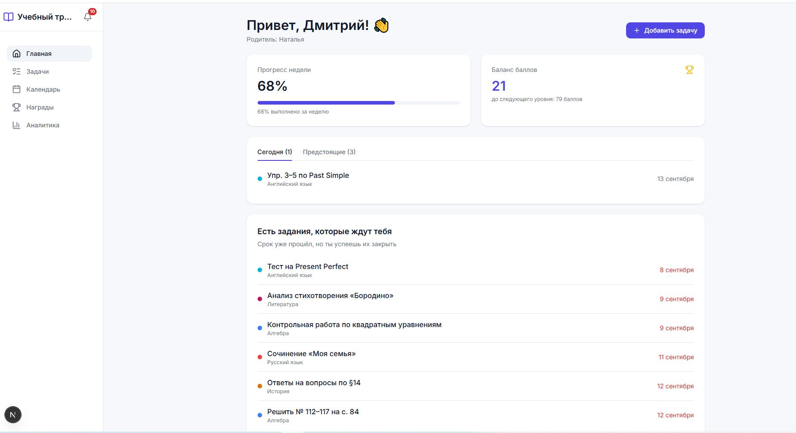
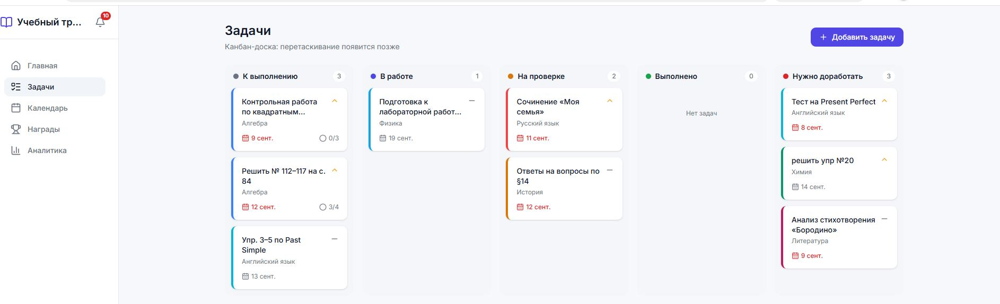
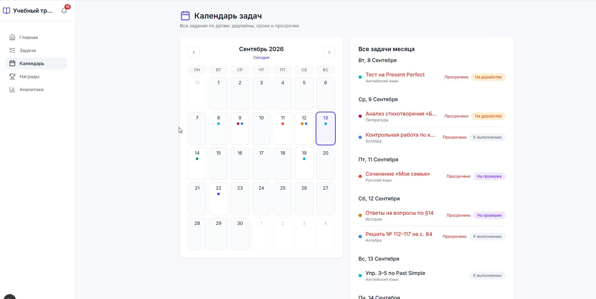
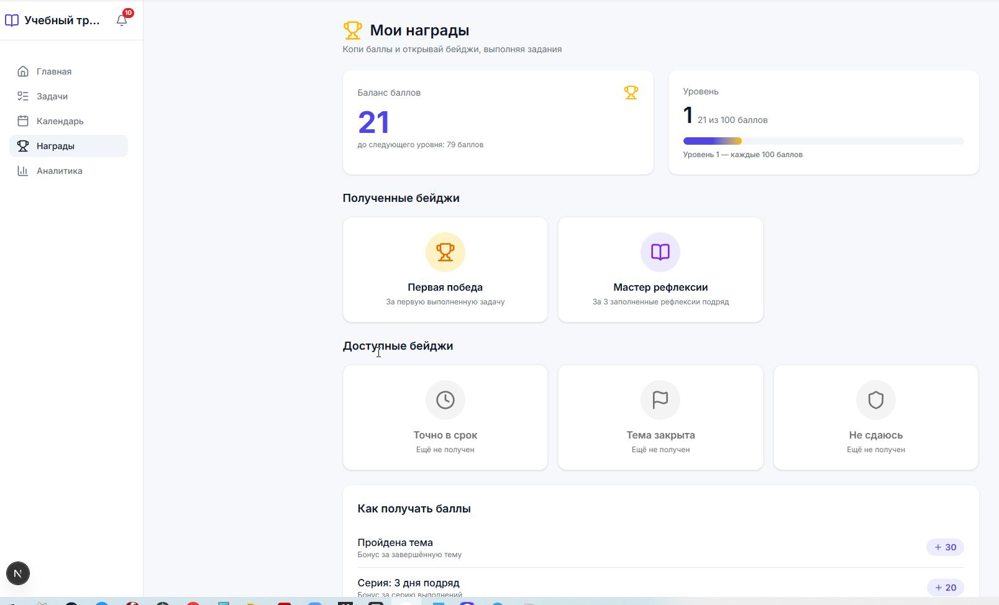
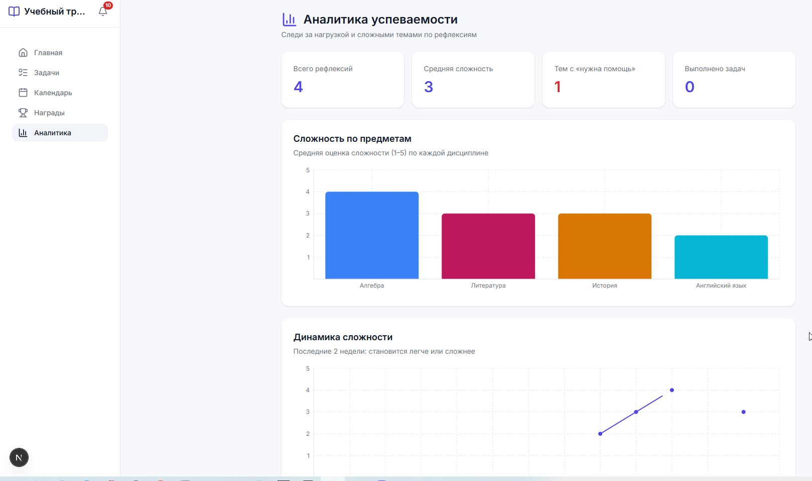

<div align="center">

# 🎓 Учебный трекер задач

**Домашние задания, дедлайны, награды и аналитика — всё в одном месте.**

Трекер задач для школьников: канбан-доска, календарь с дедлайнами, чек-листы,
система баллов и наград, рефлексия и аналитика по предметам.

</div>

---

## Возможности

- **Канбан-доска** — задачи в статусах «К выполнению», «В работе», «На проверке»,
  «Выполнено», «Нужно доработать» (drag-and-drop).
- **Календарь задач** — интерактивный месяц: клик по дню показывает задачи этой даты,
  подсветка сегодняшнего дня, пересчёт при навигации по месяцам.
- **Чек-листы** — пошаговое выполнение задания с прогрессом прямо на карточке.
- **Комментарии** — обсуждение задачи с историей и таймкодами.
- **Активность и уведомления** — журнал изменений, уведомления о новых задачах
  и статусах, «отметить все как прочитанные».
- **Баллы и награды** — начисление за выполнение, уровни прогресса, витрина наград.
- **Рефлексия** — после выполнения можно отправить рефлексию и получить баллы.
- **Аналитика** — графики сложности по предметам, динамика за неделю.
- **Роли** — администратор, учитель, ученик, родитель — с разными правами:
  учитель создаёт задачи любому ученику, родитель — только своим детям.

## Роли и демо-доступы

Репозиторий содержит готовый сид с тестовыми пользователями:

| Роль      | Email                 | Пароль       |
| --------- | --------------------- | ------------ |
| Ученик    | `student@tracker.ru`  | `Student123!`|
| Учитель   | `teacher@tracker.ru`  | `Teacher123!`|
| Родитель  | `parent@tracker.ru`   | `Parent123!` |
| Админ     | `admin@tracker.ru`    | `Admin123!`  |

## Скриншоты

| Главная (дашборд) | Задачи (канбан-доска) |
|:---:|:---:|
|  |  |

| Календарь задач | Награды |
|:---:|:---:|
|  |  |

| Аналитика |
|:---:|
|  |

## Технологии

| Слой       | Стек                                                                                              |
| ---------- | ------------------------------------------------------------------------------------------------- |
| Фронтенд   | [Next.js](https://nextjs.org) 16, [React](https://react.dev) 19, [Tailwind CSS](https://tailwindcss.com) v4 |
| UI         | shadcn/ui, lucide-react, recharts, tw-animate-css                                                |
| Бэкенд     | Next.js Route Handlers (App Router)                                                               |
| База данных| [PostgreSQL](https://www.postgresql.org) (Neon), [Prisma](https://www.prisma.io) ORM               |
| Язык       | TypeScript                                                                                        |

## Быстрый старт

Требования: **Node.js 20+** и доступ к PostgreSQL (например, [Neon](https://neon.tech)).

```bash
# 1. Установка зависимостей
npm install

# 2. Настройка окружения
cp .env.example .env
# заполните DATABASE_URL и DATABASE_URL_UNPOOLED (см. ниже)

# 3. Создание схемы БД
npx prisma db push

# 4. Наполнение тестовыми данными (учётные записи, предметы, задачи)
npm run seed

# 5. Запуск в режиме разработки
npm run dev
```

Откройте [http://localhost:3000](http://localhost:3000) и войдите, например,
под `student@tracker.ru` / `Student123!`.

### Переменные окружения

| Переменная              | Назначение                                              |
| ----------------------- | ------------------------------------------------------- |
| `DATABASE_URL`          | Подключение (пулинг) для приложения                     |
| `DATABASE_URL_UNPOOLED` | Прямое подключение (для миграций / Prisma CLI)          |

> ⚠️ `npm run seed` очищает базу перед наполнением — используйте на тестовой БД.

## Структура проекта

```
app/         — страницы и API-роуты (App Router)
  api/       — серверные route handlers
  tasks/     — канбан-доска и страница задачи
  calendar/  — календарь задач
  rewards/   — баллы и награды
  analytics/ — аналитика по предметам
components/  — клиентские компоненты (доска, календарь, модалки, графики)
lib/         — призмы, утилиты, уведомления
prisma/      — схема БД и сид
public/      — статика
img/         — скриншоты для README
```

## Лицензия

Проект распространяется в учебных целях.